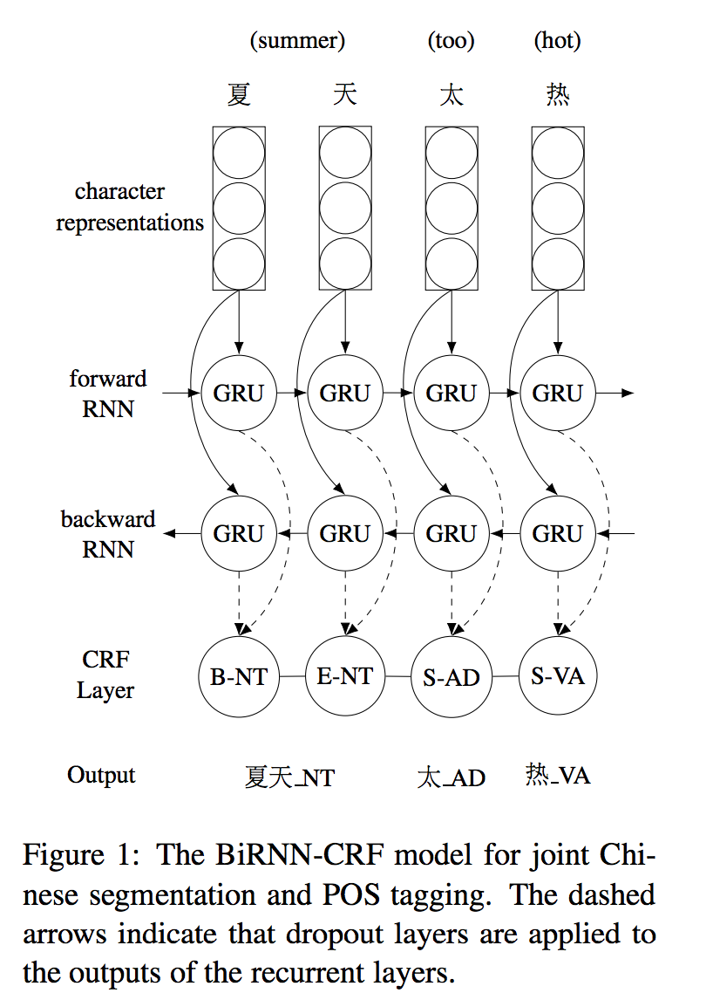
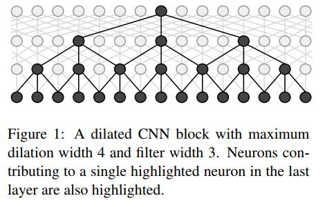

# Segment

## BI-GRU-CRF

Based on the BI-GRU CRF in Chinese word segmentation and part-of-speech tagging.

Based on the characteristics of binary words, the neural network is constructed based on the characteristics of ternary words.
 The last layer uses CRF to determine the label of the word. Specific structure as shown below.
 


you can use the following to run:

```
bazel build nlp/segment/joint_bilstm_crf:run

train：bazel-bin/nlp/segment/joint_bilstm_crf/run \
        --train_dir=/Users/endy/nlp/tensorflow_nlp/data/segment/joint/ckpt \
        --data_dir=/Users/endy/nlp/tensorflow_nlp/data/segment/joint/data \
        --utils_dir=/Users/endy/nlp/tensorflow_nlp/data/segment/joint/utils \
        --vocab_dir=/Users/endy/nlp/tensorflow_nlp/data/segment/joint/vocab \
        --num_epochs=10 \
        --process=train
        
predict：bazel-bin/nlp/segment/joint_bilstm_crf/run \
        --train_dir=/Users/endy/nlp/tensorflow_nlp/data/segment/joint/ckpt \
        --data_dir=/Users/endy/nlp/tensorflow_nlp/data/segment/joint/data \
        --utils_dir=/Users/endy/nlp/tensorflow_nlp/data/segment/joint/utils \
        --vocab_dir=/Users/endy/nlp/tensorflow_nlp/data/segment/joint/vocab \
        --predict_file=/Users/endy/nlp/tensorflow_nlp/data/segment/joint/data/raw.txt \
        --result_file=/Users/endy/nlp/tensorflow_nlp/data/segment/joint/data/result.txt \
        --process=infer
```

## IDCNN-CRF

For sequence-tagging, ordinary CNN has a disadvantage that after convolution, the last neuron may simply get a small piece of information in the original input data.
For NER, every word of the sentence is likely to have an impact on the words that need to be marked. In order to cover all the information into the input need to add more convolution layer,
resulting in more and more layers, more and more parameters, and in order to prevent over-fitting we must add more dropout of regularization, this bring more super-parameters, the whole model becomes huge and difficult to train.
Because of the disadvantages of CNN, for sequence-tagging, people use biLSTM as far as possible the use of the network memory to remember the whole sentence of information.

But the problem is that biLSTM is, after all, a sequence model that is as powerful as CNN's optimization on GPU parallel computing. How can CNN as to the GPU to provide a full fire battlefield,
but like LSTM with a simple structure to remember as much as possible input information?

Fisher Yu and Vladlen Koltun 2015 presented a dilated CNN model, meaning "dilated" CNN. In fact, the idea is very simple: normal CNN filter, are acting on the input matrix in a continuous position,
constantly sliding to do convolution. dilated CNN adds a dilation width to this filter, which will skip all the input data in the middle of the dilation width when the input matrix is ​​passed;
and the size of the filter matrix itself remains the same, so that the filter gets on a wider input matrix Of the data, looks like "inflated" in general.


Corresponding to the text, the input is a one-dimensional vector, each element is a character embedding:



Our model is 4 large Dilated CNN blocks of the same structure, each of which is a three-tier Dilated convolution layer with a dilation width of 1, 1, 2, so called Iterated Dilated CNN.

IDCNN generates a logits for each word of the input sentence, which is exactly the same as the biLSTM model output logits, into the CRF Layer, and the Viterbi algorithm to decode the result.

you can use the following to run:

```
bazel build nlp/segment/idcnn:run

train：bazel-bin/nlp/segment/idcnn/run \
    --ckpt_path=/Users/endy/nlp/tensorflow_nlp/data/segment/idcnn/ckpt \
    --log_path=/Users/endy/nlp/tensorflow_nlp/data/segment/idcnn/log \
    --vocab_path=/Users/endy/nlp/tensorflow_nlp/data/segment/idcnn/vocab \
    --config_path=/Users/endy/nlp/tensorflow_nlp/data/segment/idcnn/config \
    --emb_file=/Users/endy/nlp/tensorflow_nlp/data/segment/idcnn/data/vec.txt \
    --train_file=/Users/endy/nlp/tensorflow_nlp/data/segment/idcnn/data/example.train \
    --dev_file=/Users/endy/nlp/tensorflow_nlp/data/segment/idcnn/data/example.dev \
    --test_file=/Users/endy/nlp/tensorflow_nlp/data/segment/idcnn/data/example.test \
    --model_type=idcnn \
    --process=train \
    --max_epoch=10
        
predict：bazel-bin/nlp/segment/idcnn/run \
    --ckpt_path=/Users/endy/nlp/tensorflow_nlp/data/segment/idcnn/ckpt \
    --log_path=/Users/endy/nlp/tensorflow_nlp/data/segment/idcnn/log \
    --vocab_path=/Users/endy/nlp/tensorflow_nlp/data/segment/idcnn/vocab \
    --config_path=/Users/endy/nlp/tensorflow_nlp/data/segment/idcnn/config \
    --emb_file=/Users/endy/nlp/tensorflow_nlp/data/segment/idcnn/data/vec.txt \
    --raw_file=/Users/endy/nlp/tensorflow_nlp/data/segment/idcnn/data/example.raw \
    --result_path=/Users/endy/nlp/tensorflow_nlp/data/segment/idcnn/data \
    --model_type=idcnn \
    --process=infer

```

# Reference

- [Character-based Joint Segmentation and POS Tagging for Chinese using Bidirectional RNN-CRF](https://arxiv.org/pdf/1704.01314.pdf)
- [Towards Deep Learning in Hindi NER: An approach to tackle the Labelled Data Scarcity](https://arxiv.org/abs/1610.09756)
- [Multi-Scale Context Aggregation by Dilated Convolutions](https://arxiv.org/abs/1511.07122) 
- [Fast and Accurate Entity Recognition with Iterated Dilated Convolutions](https://arxiv.org/abs/1702.02098)
